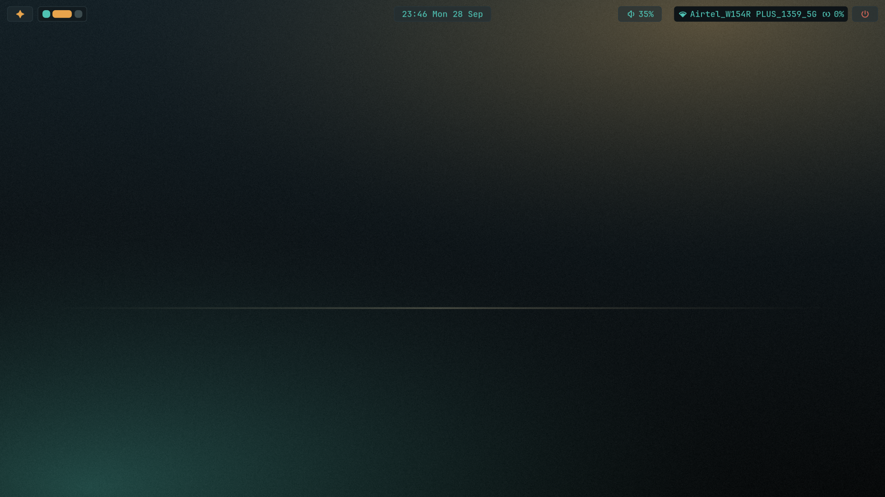

# Nyanja

A personal Linux desktop rice for CachyOS, built around Hyprland, Noctalia Shell, Starship, and a custom Nyanja color palette.

The configuration focuses on a clean, dark desktop with warm orange highlights, teal accents, rounded UI elements, and a matching wallpaper.

## Showcase



## What is included

- **Hyprland** configuration split into focused Lua modules for:
  - keybindings
  - autostart applications
  - animations
  - decorations
  - colors
  - input and monitor settings
  - window rules and workspaces
- **Noctalia Shell** configuration with:
  - a custom top bar layout
  - workspace pills
  - clock, volume, network, battery, and session widgets
  - dark theme settings
  - custom `Nyanja` palette integration
  - lockscreen configuration
- **Starship** prompt with Git branch, status, path, and command-duration information
- **Wallpaper** used by the desktop theme

## Repository layout

```text
.
├── hypr/
│   ├── config/              # Modular Hyprland settings
│   ├── hyprland.lua         # Main Hyprland configuration
│   ├── hyprland-gui.lua     # GUI-related Hyprland settings
│   └── *.conf                # Additional compositor configuration
├── noctalia-config/
│   ├── config.toml           # Noctalia Shell configuration
│   └── palettes/Nyanja.json  # Custom color palette
├── noctalia-state/
│   └── settings.toml         # Noctalia state and widget settings
├── screenshot/
│   └── home-screen.png       # Desktop showcase image
├── starship/
│   └── starship.toml         # Shell prompt configuration
└── wallpapers/
    └── nyanja-wallpaper.png  # Matching wallpaper
```

## Requirements

This setup is intended for a Linux system using a Wayland session. You will likely need:

- [CachyOS](https://cachyos.org/) or another Arch-based distribution
- [Hyprland](https://hyprland.org/)
- [Noctalia Shell](https://github.com/noctalia-dev/noctalia-shell)
- [Starship](https://starship.rs/)
- JetBrains Mono Nerd Font
- The utilities referenced by your local Hyprland and Noctalia configuration

Some paths and settings are machine-specific, so review the files before applying them to another system.

## Installation

> **Back up your existing configuration first.** These files are personal configuration files and may overwrite or conflict with settings already on your system.

Clone the repository:

```bash
git clone https://github.com/sparechange679/nyanja.git
cd nyanja
```

Copy or link the relevant directories into your user configuration directory. For example:

```bash
mkdir -p ~/.config

cp -r hypr ~/.config/
cp -r noctalia-config ~/.config/
cp -r noctalia-state ~/.config/
mkdir -p ~/.config/starship
cp starship/starship.toml ~/.config/starship/starship.toml
```

Set the wallpaper path in the Noctalia settings if necessary. The checked-in configuration currently references a local wallpaper path, so update it to match your username and wallpaper location before starting the shell.

Finally, restart Hyprland or reload the relevant services to apply the configuration.

## Customization

The main visual settings are concentrated in:

- `hypr/config/colors.lua` for compositor colors
- `noctalia-config/palettes/Nyanja.json` for the shared Noctalia palette
- `noctalia-config/config.toml` for the bar, widgets, theme, and shell behavior
- `noctalia-state/settings.toml` for stateful widget and lockscreen preferences
- `starship/starship.toml` for the terminal prompt

Feel free to adapt the keybindings, monitor layout, wallpaper paths, and autostart commands for your own hardware.

## Notes

- This is a personal rice rather than a universal installer.
- Hardware-specific values such as monitor names, resolutions, and wallpaper paths may need to be changed.
- Inspect the configuration before copying it into `~/.config`.

## License

No license has been specified yet. Unless a license is added, the contents of this repository should be treated as all rights reserved by the author.
